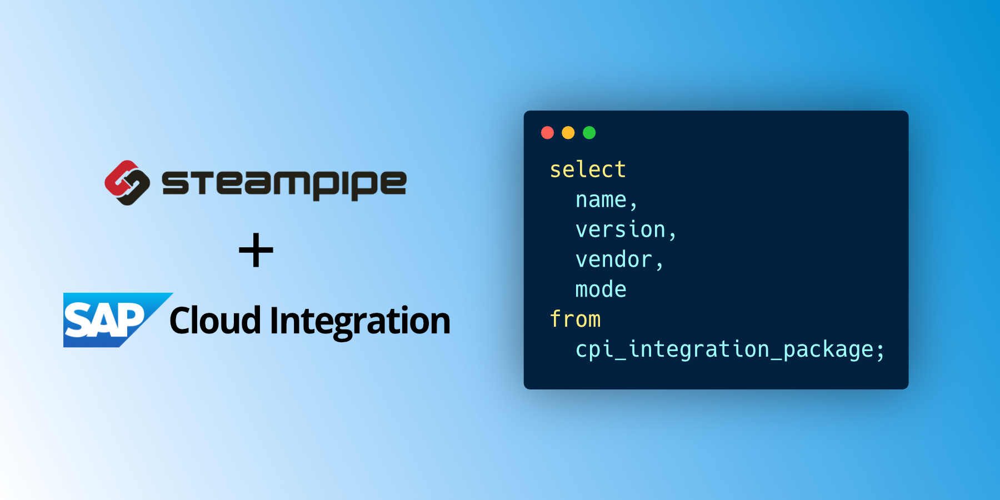

# SAP Cloud Integration plugin for Steampipe

Use SQL to query artifacts from SAP Cloud Integration.

- **[Get started →](https://hub.steampipe.io/plugins/vadimklimov/cpi)**
- Documentation: [Table definitions & examples](docs/tables)
- Community: [Join #steampipe on Slack →](https://turbot.com/community/join)
- Get involved: [Issues](https://github.com/vadimklimov/steampipe-plugin-cpi/issues)

## Quick start

Install the plugin with [Steampipe](https://steampipe.io):

```shell
steampipe plugin install vadimklimov/cpi
```

Configure your [credentials](https://hub.steampipe.io/plugins/turbot/cpi#credentials) and [config file](https://hub.steampipe.io/plugins/turbot/cpi#configuration).


Run a query to list integration packages in an SAP Cloud Integration tenant:

```sql
select
  name,
  version,
  vendor,
  mode
from
  cpi_integration_package;
```

## Developing

Prerequisites:

- [Steampipe](https://steampipe.io/downloads)
- [Golang](https://golang.org/doc/install)

Clone:

```shell
git clone https://github.com/vadimklimov/steampipe-plugin-cpi.git
cd steampipe-plugin-cpi
```

Build, which automatically installs the new version to your `~/.steampipe/plugins` directory:

```shell
make
```

Configure the plugin:

```shell
cp config/* ~/.steampipe/config
vi ~/.steampipe/config/cpi.spc
```

Try it!

```shell
steampipe query
> .inspect cpi
```

Further reading:

- [Writing plugins](https://steampipe.io/docs/develop/writing-plugins)
- [Writing your first table](https://steampipe.io/docs/develop/writing-your-first-table)

## Open Source & Contributing

This repository is published under the [Apache 2.0](https://www.apache.org/licenses/LICENSE-2.0) (source code) and [CC BY-NC-ND](https://creativecommons.org/licenses/by-nc-nd/2.0/) (docs) licenses. Please see our [code of conduct](https://github.com/turbot/.github/blob/main/CODE_OF_CONDUCT.md). We look forward to collaborating with you!

[Steampipe](https://steampipe.io) is a product produced from this open source software, exclusively by [Turbot HQ, Inc](https://turbot.com). It is distributed under our commercial terms. Others are allowed to make their own distribution of the software, but cannot use any of the Turbot trademarks, cloud services, etc. You can learn more in our [Open Source FAQ](https://turbot.com/open-source).

## Get Involved

**[Join #steampipe on Slack →](https://turbot.com/community/join)**

Want to help but don't know where to start? Pick up one of the `help wanted` issues:

- [Steampipe](https://github.com/turbot/steampipe/labels/help%20wanted)
- [CPI Plugin](https://github.com/vadimklimov/steampipe-plugin-cpi/labels/help%20wanted)
